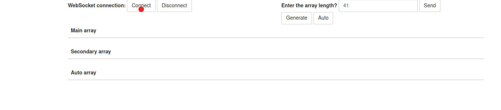
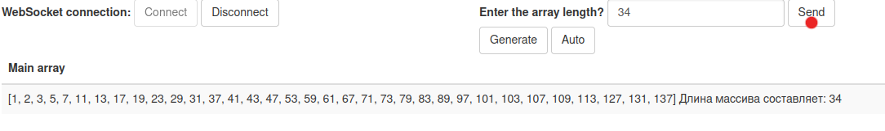
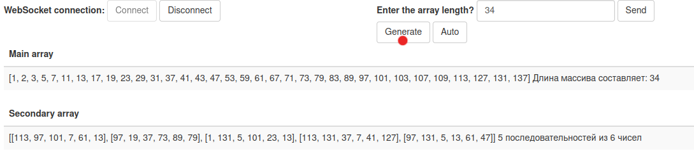
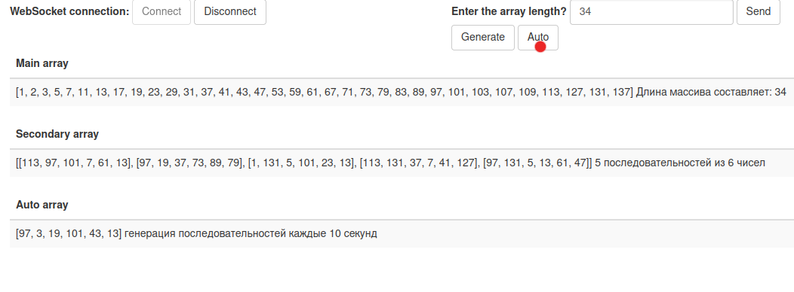

## mgstest
- Задача сгенерировать 5 последовательностей простых чисел длинной от 10 до 100 чисел в массиве, длина задается из WEB - интерфейса
- Используя Spring boot реализовать WebSocket сервер и вывод HTML страницы
- HTML страница должна задавать длину массива простых чисел. Массив генерируется
  разово и не изменяется до следующего запроса генерации массива из WEB UI.
- Со страницы HTML запускается алгоритм генерации случайных последовательностей,
  где имеется 2 варианта работы «АВТО» и «СГЕНЕРИРОВАТЬ», при нажатии на кнопку
  «СГЕНЕРИРОВАТЬ» выдается 5 последовательностей чисел по 6 случайных числ из
  каждого массива. Последовательность чисел должна исключать дублия. При нажатии на
  кнопку «АВТО» последовательность генерируется каждые 10 секунд и передается в UI.
  Последовательность чисел отображается в таблице.
- Обмен данными с сервером осуществлять в формате JSON.

Запускаем WebSocket connection: 
 
Вводим число (длину последовательности)
 
Отправляем - получаем последовательность
 
Генерируем 5 последовательностей из 6 чисел
 
Генерируем последовательность каждые 10 секунд
 
### Контакты для связи 
 arvikvan@gmail.com 
 @ArvikV

###Используемые технологии:
- Gradle
- GitHub Action
- Spring boot
- WebSocket

